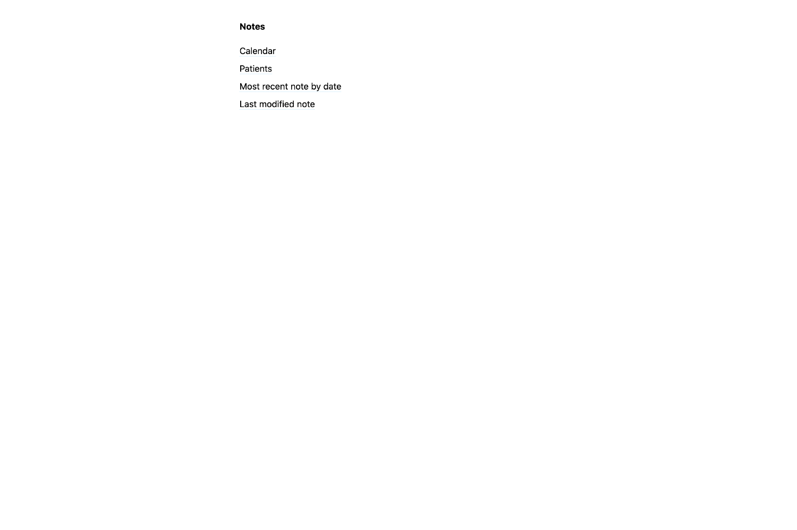

## Hugo Clinic Notes

A Hugo theme for the generation, organisation, and viewing of patient notes written in markdown, ideal for a physiotherapy or similar clinic that needs to maintain patient records.



- View all notes organised by date
- View all patients organised alphabetically
- Jump straight to latest note by date
- Jump straight to last modified note
- Auto generate patient, date, and description metadata from filenames

### Prerequisites

You need to install the Hugo CLI. For macOS users, you can install with [homebrew](https://brew.sh/).
```
brew install hugo
```

For Windows users, you can install with [choco](https://chocolatey.org/):
```
choco install hugo-extended -confirm
```

### Getting started

Create a new Hugo project folder at the command line with 

```
hugo new site your-project-name
```

Then change into that directory and run:

```
cd your-project-name
git submodule add https://github.com/jmablog/hugo-clinic-notes.git themes/hugo-clinic-notes
```

Next, copy the contents of the [`exampleSite/config.toml`](https://github.com/jmablog/hugo-clinic-notes/blob/master/exampleSite/config.toml) to your own project's `config.toml`. You can update the fields found in this file using the comments provided (the lines after `#`) as a guide.

Finally, run:

```
hugo server -F 
```

and open your preferred browser to the localhost address Hugo gives you at the command line to view your notes' homepage.

(You need the `-F` flag so that Hugo will also include notes with a date in the future, allowing you to add notes for an appointment in the future)

**If you are seeing a blank page it is probably because you have nothing in your `content/all` directory. Let's add some!**

### Adding patients

Patients are added at the time that you need to create a new note for them. All patients end up in the `content/all` folder, in a different format depending on three different note types:

- **Assessments:** for initial / first sessions with a patient, created as a markdown file under `content/all/patient-name/`
- **Follow ups:** for subsequent sessions with a patient, created as a markdown file under `content/all/patient-name/`
- **Other:** for any other note, including embedded images in notes and linking to PDFs, ideal for things like scans, x-rays, notes from other professionals, etc. Created as a folder under `content/all/patient-name/` with an index.md file to contain the actual note, with any media just placed alongside it in the same folder.

**Filenames are very important for this system!** When you create a note, you must use the filename format:

```
hugo new -kind note-type all/patient-name/yyyy-mm-dd-patient-name-note-type.md
```

For example, for a **new assessment** for a patient named John Smith seen on 1st January 2020:

```
hugo new --kind assessment all/john-smith/2020-01-01-john-smith-assessment.md
```

Hugo will auto fill in patient name and date fields in resulting markdown file using this filename. The -assessment at the end is needed to correctly strip the filename down to patient name.

For **new follow-up note** for the same patient the next day:

```
hugo new --kind follow-up all/patient-name/2020-01-02-patient-name-follow-up.md
```

Similar to assessment setup, Hugo will auto fill in patient name and date fields and the -follow-up is required to correctly strip the filename.

For a **new other note** for the same patient, again the next day, creating a directory that media (pdfs, images, etc) can be put in and linked to from the form, you can also supply a description of the note at the end of the filename:

```
hugo new --kind other all/john-smith/2020-01-03-john-smith-description_of_contents
```

Hugo will again gather the patient name and dates from the filename and fill in appropriately. **But**, notice the lack of `-other` and `.md` at the end of the filename - this is because Hugo is creating a directory, not a file, which will contain an `index.md` file that will be the final editable form.

It is also important that `description_of_contents` uses `_` (underscores) to separate words rather than `-` dashes so that Hugo will correctly identify and separate the two parts of the filename.

It doesn't matter if a patient is brand new or already exists, it's the exact same commands!

### Editing default notes

If you'd like to change the layout or content of any of the default note types, just copy the associated file from `themes/hugo-clinic-notes/archetypes` to the archetypes folder in the base of your Hugo project (e.g. `your-project-name/archetypes`). Any changes made to the copied files will overwrite the archetypes in the template and be used by Hugo instead.

Be sure not to change any of the metadata in the front matter (the bits between the two `---` code fences) or you may break the site.

You can otherwise change the content of the notes as you need, using [markdown](https://www.markdownguide.org/). You can use tables, include images, or use bold and italic text.

Anything between two curly braces (`{{ }}`) is code Hugo uses to fill in some of the details of the note from the filename, such as the patient name or date - feel free to cut and paste these bits anywhere else you may want to use them.

Be aware that headers (created using `#`) are styled differently depending on their level - it's suggested to generate some defaults first to see what they look like and choose the appropriate heading you want. 

Any italic text included in a H4 heading (e.g. `#### Header *italic text*`) will be styled light grey and appear next to the H4, ideal for making notes on what content should go under the header.

### Editing styles

This theme uses [TailwindCSS](https://tailwindcss.com/). The included CSS file (in `theme/hugo-clinic-notes/static/styles.css`) has been [purged](https://tailwindcss.com/docs/controlling-file-size) of any unused CSS to keep filesize down. If you'd like to modify the styles, it's recommended to [install TailwindCSS](https://tailwindcss.com/docs/installation/#app) in your project folder, and have Tailwind create a new `styles.css` in `your-project-name/static` that will supersede the theme styles. Here is a recommended `tailwind.config.js` file:

```
module.exports = {
	purge: {
		enabled: true,
		content: [
            './layouts/**/*.html',
            './layouts/*.html',
            './themes/hugo-clinic-notes/layouts/**/*.html',
            './themes/hugo-clinic-notes/layouts/*.html',
        ]
	},
	theme: {
		extend: {
			screens: {
				print: { raw: 'print' }
			}
		}
	},
	variants: {},
	plugins: []
};
```

### Patient Privacy

It is recommended to just run this as a local web app, viewing the notes on the localhost address served by Hugo, rather than generating this as an actual website uploaded somewhere, to avoid any patient privacy issues.